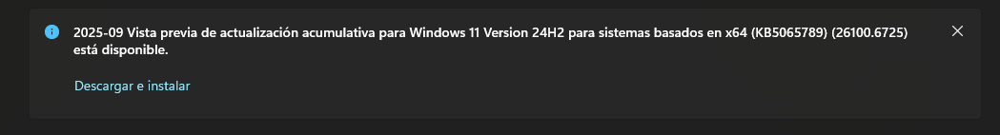
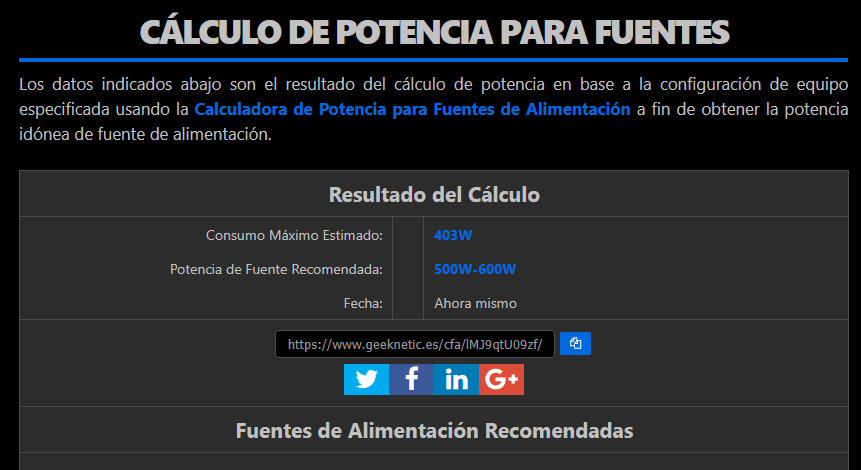

<h1>Mi Entorno de Desarrollo</h1>

<h2>Inventario de Hardware y Software</h2>

|  Hardware | Valor |
|----------|----------|
| Modelo del Equipo   |      MS-7B86       |
| CPU     | AMD R7 5800x  |
| RAM   | 32GB DDR4 3000MHz  |
| Almacenamiento   | 2TB   |
| Tarjeta Gráfica   | RTX 3060   |
| Sistema Operativo   | Windows 11 Pro   |
| Entorno de desarrollo   | Windows 11 con VSCode y Git Configurados   |
| IDEs Instalados   | VSCode, Intellij IDEA   |
| Extensiones Relevantes   | Composer, Format HTML in PHP, Gradle for Java, MD Preview, PHP, Git Graph  |
| Herramientas   | Git con Github, Postman, Microsoft Teams, Docker Desktop, SQL Workbench   |
| Lenguajes de programacion   | Java, PHP, ""HTML"", CSS, JavaScript    |
| Base de datos   | Firebase Firestore, MySQL   |

<h2>Optimizar y actualizar su entoro de desarrollo</h2>

Al acabar el curso pasado, hice un reseteo de todos los discos duros de mi ordenador. Al arrancar este curso he ido instalando todos los IDEs y lenguajes, que utilizo en clase, por lo que lo único que tengo que actualizar es el SO.

<h2>Sostenibilidad en el desarrollo</h2>

Con los componentes que tengo he visitado la página web https://www.geeknetic.es/calculadora-fuente-alimentacion, y he calculado el consumo de mis componentes.

https://www.geeknetic.es/cfa/lMJ9qtU09zf/ Resultado.

Esto es lo que consumiría mi PC a máxima potencia, con todo trabajando al máximo. Programando estaría en unos 250W, (sin contar pantallas) que es un poco elevado simplemente para programar, pero también lo uso para jugar, por lo que es un equilibrio, no tengo lo mas tope de gama, pero me da para lo que necesito.

<h2>Reflexiones para examen</h2>

<b>¿Por qué es importante mantener el software actualizado?</b>

Sobre todo porque las actualizaciones, tienen parches de seguridad, que corrigen errores que podían aprovechar los ciberdelincuentes, tambien traen nuevas funcionalidades, y mejoran el rendimiento.

<b>¿Cómo afecta el uso de versiones antiguas al rendimiento y seguridad?</b>
Como tal las versiones mas antiguas suelen ser mas lentas que las actuales en temas de rendimiento. En seguridad al no recibir actualizaciones, los ciberdelincuentes lo tienen mas facil para acceder y robar datos.

<b>¿Qué es el PATH y para qué se usa?</b>
El PATH es una variable de entorno del SO, lo que hace es indicar donde buscar los programas ejecutables cuando ejecutas un comando.

<b>¿Cómo puede un desarrollador reducir el impacto ambiental de su trabajo diario?</b>

Sobretodo con el uso del ordenador y sus componentes, es decir, para programar, no hace falta la mejor tarjeta gráfica o el mejor procesador con un montón de RAM, hay que ver en que se va a desarrollar nuestro trabajo y a partir de ahí elegir los componentes que mejor se ajusten. Tambien los desarrolladores utilizan mucho el almacenamiento en la nube, y muchas veces se usa como un vertedero, donde subimos todo, eso también se podría evitar haciendo inventario de lo que nos puede servir o lo que ya está obsoleto y no sirve para nada.

<b>¿Qué prácticas sostenibles podrías implementar en tus proyectos ahora mismo?</b>

Lo que se me ocurre es optimizar el código, ya que optimizando reduces el tiempo de procesamiento, por lo tanto menos consumo energético.

<h2>Reflexión Personal</h2>

Después de hacer esta actividad me he dado cuenta de que muchas veces no somos conscientes del impacto que tiene la tecnología que usamos todos los días. Siempre pensamos en que el ordenador sea rápido o que tenga buena gráfica, pero no en la energía que gasta o en si realmente necesitamos tanta potencia.

También me ha hecho pensar que mantener el equipo ordenado y actualizado no solo mejora el rendimiento, sino que también ayuda a no tener programas inútiles consumiendo recursos.
